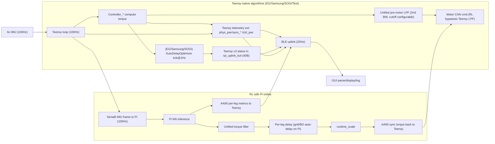
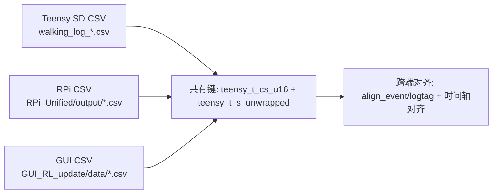

# Hip Exoskeleton System Architecture

## 1. Devices

Teensy 4.1, SIG / T-Motor (x2), IM948 IMU (x6), BLE Transceiver for IMU, Adafruit ItsyBitsy nRF52840 (x2, GUI link), Raspberry Pi 5, Host PC, SD Card (on Teensy)

---

## 2. Teensy Serial Ports & Communication Protocols

| Serial Port | Baud Rate | Connected Device | Protocol | Frequency | Direction |
|---|---|---|---|---|---|
| **Serial (USB)** | 115200 | PC debug console | ASCII text | 10 Hz print | TX |
| **Serial1** | 460800 | IMU P1 (via BLE transceiver) | IM948 binary | 100 Hz | RX/TX |
| **Serial2** | 460800 | IMU P2 (via BLE transceiver) | IM948 binary | 100 Hz | RX/TX |
| **Serial3** | 460800 | IMU P3 (via BLE transceiver) | IM948 binary | 100 Hz | RX/TX |
| **Serial4** | 460800 | IMU P4 (via BLE transceiver) | IM948 binary | 100 Hz | RX/TX |
| **Serial5** | 115200 | BLE Transceiver (GUI link) | **128-byte** binary frames | TX: 20 Hz, RX: event-driven | RX/TX |
| **Serial6** | 460800 | IMU Right Thigh (via BLE transceiver) | IM948 binary | 100 Hz | RX/TX |
| **Serial7** | 460800 | IMU Left Thigh (via BLE transceiver) | IM948 binary | 100 Hz | RX/TX |
| **Serial8** | 115200 | Raspberry Pi 5 | Binary frames (34B TX v2 / 32B TX v1 / 26B legacy RX / 42B sync RX) | 100 Hz | RX/TX |
| **CAN3** | 1 Mbps | Motors (x2) | CAN 2.0 (SIG/T-Motor) | 100 Hz | RX/TX |

---

## 3. Data Flow

### 3.1 System Diagram

```
                                    +-----------+
                                    |  Host PC  |
                                    |  (GUI.py) |
                                    +-----+-----+
                                          |
                                     USB Serial
                                     115200 baud
                                          |
                              +-----------+-----------+
                              | BLE Central           |
                              | (ItsyBitsy nRF52840)  |
                              +-----------+-----------+
                                          |
                                    BLE UART
                                 128-byte frames
                                 MTU=247, 2Mbps PHY
                                          |
                              +-----------+-----------+
                              | BLE Peripheral        |
                              | (ItsyBitsy nRF52840)  |
                              +-----------+-----------+
                                          |
                                    Serial5 (UART)
                                    115200 baud
                                          |
+------------------+              +-------+--------+              +-----------------+
|   Raspberry Pi 5 | -- Serial8 --| Teensy 4.1     |-- CAN3 1Mbps--|  Motors (x2)   |
|   (RL Neural Net)|   115200     | (Main Control) |              | SIG / T-Motor   |
+------------------+              +-------+--------+              +-----------------+
                                          |
                              Serial1,2,3,4,6,7
                              460800 baud each
                                          |
                              +-----------+-----------+
                              | BLE Transceiver (IMU) |
                              +-----------+-----------+
                                          |
                                    Wireless
                                          |
                         +----------------+----------------+
                         |        |        |        |      |        |
                       IMU_L   IMU_R   IMU_1   IMU_2   IMU_3   IMU_4
                      (Ser7)  (Ser6)  (Ser1)  (Ser2)  (Ser3)  (Ser4)
                       Left    Right   Pos1    Pos2    Pos3    Pos4
                       Thigh   Thigh
```


---

## 4. Key Code Locations

### 4.1 当前使用的代码 (Active)

| Component | Path | Description |
|---|---|---|
| **Teensy 主固件** | `All_in_one_hip_controller_RL_update/All_in_one_hip_controller_RL_update.ino` | 多算法主循环 |
| Motor driver 抽象层 | `All_in_one_hip_controller_RL_update/MotorDriver.h` | SIG/TMOTOR 运行时切换 |
| BLE 协议 (128B) | `All_in_one_hip_controller_RL_update/BleProtocol.h` | 上下行帧打包/解析 |
| Controller 基类 | `All_in_one_hip_controller_RL_update/Controller.h` | 算法抽象接口 |
| EG 算法 | `All_in_one_hip_controller_RL_update/Controller_EG.h/.cpp` | Energy Gate (~12 params) |
| Samsung 算法 | `All_in_one_hip_controller_RL_update/Controller_Samsung.h/.cpp` | Samsung (kappa, delay) |
| RL 算法 | `All_in_one_hip_controller_RL_update/Controller_RL.h/.cpp` | Serial8 ↔ RPi 透传 |
| Test 模式 | `All_in_one_hip_controller_RL_update/Controller_Test.h` | 固定/正弦力矩 |
| Motor SIG | `All_in_one_hip_controller_RL_update/Motor_Control_Sig.h/.cpp` | ODrive CAN 驱动 |
| Motor TMOTOR | `All_in_one_hip_controller_RL_update/Motor_Control_Tmotor.h/.cpp` | VESC CAN 驱动 |
| IMU 驱动 | `All_in_one_hip_controller_RL_update/im948_CMD.h`, `im948_CMD.ino` | IM948 协议 |
| IMU 适配 | `All_in_one_hip_controller_RL_update/IMU_Adapter.h/.cpp` | 6路IMU统一接口 |
| SD 日志 | `All_in_one_hip_controller_RL_update/sdlogger.h/.cpp` | Teensy SD 卡日志 |
| **GUI** | `GUI_RL_update/GUI.py` | 参数调节 + 实时绘图 |
| **RPi RL 控制器** | `RPi_Unified/RL_controller_torch.py` | 唯一入口, CLI 选网络 |
| RPi 神经网络 | `RPi_Unified/networks/dnn.py`, `lstm_network.py`, `lstm_leg_dcp.py`, `lstm_pd.py` | 4种网络定义 |
| RPi 网络基类 | `RPi_Unified/networks/base_network.py` | Network (nn.Module) |
| RPi 滤波器库 | `RPi_Unified/filter_library.py` | IIR/EMA/Kalman 滤波器 |
| RPi DNN 模型 | `RPi_Unified/models/dnn/Trained_model*.pt` | DNN 权重文件 |
| RPi LSTM 模型 | `RPi_Unified/models/lstm/end2end/` | LSTM 权重 (按 motion_type 分目录) |

### 4.2 历史/参考代码 (Archive)

| Component | Path | Description |
|---|---|---|
| 旧版 Teensy (无算法切换) | `All_in_one_hip_controller/` | 不支持多算法切换的旧固件 |
| 旧版 GUI (无 RL) | `GUI/` | 不含 RL 面板的旧版 GUI |
| 旧部署代码 (参考) | `Deployment/RL_controller_torch.py` | 单 LSTM_PD 部署脚本 (已验证可用) |
| 旧部署 NN 定义 (参考) | `Deployment/DNN_torch_end2end.py` | 所有 NN class 的原始定义 |
| 其他归档 | `Archive_Old_Reference/` | 历史版本 |

---

## 5. Multi-Algorithm Architecture (v3.0 Update)

### 5.1 Overview

The system now supports **runtime-switchable control algorithms** via GUI, without recompilation. All algorithms share a common `Controller` base class interface.

```
All_in_one_hip_controller_RL_update/
├── All_in_one_hip_controller_RL_update.ino  ← 主循环（精简）
├── MotorDriver.h                      ← 电机抽象层 (SIG/TMOTOR 运行时切换)
├── BleProtocol.h                      ← 128字节帧打包/解析
├── Controller.h                       ← 算法抽象基类
├── Controller_EG.h / .cpp             ← Energy Gate 算法 (~12 params)
├── Controller_Samsung.h / .cpp        ← Samsung 算法 (2 params: kappa, delay)
├── Controller_RL.h / .cpp             ← RL 神经网络 (Serial8 ↔ RPi)
├── Controller_Test.h                  ← 测试模式 (固定力矩)
├── Motor_Control_Sig.h / .cpp         ← SIG (ODrive) 底层驱动
├── Motor_Control_Tmotor.h / .cpp      ← TMOTOR (VESC) 底层驱动
├── IMU_Adapter.h / .cpp               ← 6路IMU适配
├── sdlogger.h / .cpp                  ← SD 日志
└── im948_CMD.h / .ino                 ← IMU 协议
```

### 5.2 Controller Interface

所有算法实现以下接口（定义在 `Controller.h`）:

```cpp
class Controller {
  virtual void compute(const CtrlInput& in, CtrlOutput& out) = 0;
  virtual void parse_params(const BleDownlinkData& dl) = 0;
  virtual void reset() = 0;
  virtual const char* name() const = 0;
  virtual AlgoID id() const = 0;
};
```

- `CtrlInput`: IMU 角度、滤波值、步态频率、控制周期等
- `CtrlOutput`: 左/右腿输出扭矩 (Nm, 输出轴)
- 切换算法时自动调用 `reset()` 清零内部状态

### 5.3 算法实例 (静态分配)

```cpp
static Controller_EG      ctrl_eg;
static Controller_Samsung ctrl_samsung;
static Controller_RL      ctrl_rl;
static Controller_Test    ctrl_test;
Controller* active_ctrl = &ctrl_eg;  // 运行时指针
```

**没有 `new`/`delete`**，所有算法实例在编译时静态分配。

### 5.4 主循环流程

```
loop() {
  1. 处理异步命令 (IMU reinit / Motor reinit / Brand switch)
  2. 读取 IMU
  3. 安全检测 (角度 > 80° 则禁用)
  4. [100Hz 节拍]:
     a. 接收 CAN 电机反馈
     b. 接收 BLE 下行 → 解析 → 算法参数更新 / 算法切换
     c. IMU 滤波 + 步态频率估计
     d. 填充 CtrlInput
     e. active_ctrl->compute(input, output)
     f. 统一“电机前”扭矩滤波 (Teensy-native 算法生效; RL 路径旁路保持透明)
     g. 下发电机命令 (通过 MotorDriver 抽象层)
     h. SD 日志
  5. [20Hz 节拍]: BLE 上行发送
  6. [10Hz]: 串口调试打印
}
```

---

## 6. BLE Protocol (128 bytes)

### 6.1 帧格式

BLE 上下行均为 128 字节帧: `[0xA5] [0x5A] [0x80] [125 bytes payload]`

BLE 中间板 (ItsyBitsy) 的 `rs232_datalength` 和 `ble_datalength` 均已设为 128。

### 6.2 上行帧 (Teensy → GUI)

| Byte | Content | Type | Description |
|------|---------|------|-------------|
| 0-2 | Header | - | 0xA5 0x5A 0x80 |
| 3-4 | t_cs | uint16 | 时间戳 (厘秒) |
| 5-6 | L_ang | int16 | 左腿角度 ×100 |
| 7-8 | R_ang | int16 | 右腿角度 ×100 |
| 9-10 | L_tau | int16 | 左实测扭矩 ×100 |
| 11-12 | R_tau | int16 | 右实测扭矩 ×100 |
| 13-14 | L_cmd | int16 | 左命令扭矩 ×100 |
| 15-16 | R_cmd | int16 | 右命令扭矩 ×100 |
| 17 | imu_ok | uint8 | IMU 状态 |
| 18-19 | mt | int16 | max_torque ×100 |
| 20 | sd_ok | uint8 | SD 状态 |
| 23-24 | gf | int16 | 步态频率 ×100 |
| 25 | tag_ok | uint8 | logtag 是否有效 |
| 26 | tag_ch | uint8 | logtag 首字母 |
| 27 | imu_bits | uint8 | 6路IMU位图 |
| 28 | brand | uint8 | 当前电机品牌 |
| 29-30 | temp | int8×2 | 电机温度 L/R |
| 31 | algo | uint8 | 当前活动算法 ID |
| 32-39 | imu1-4_ang | int16×4 | IMU1-4 角度 ×100 |
| 40-51 | imu_vel | int16×6 | IMU L/R/1/2/3/4 角速度 ×10 |
| 52-57 | imu_batt | uint8×6 | IMU L/R/1/2/3/4 电量百分比（0-100，255=未知） |
| 58-60 | reserved | - | Teensy 预留 |
| **61-100** | **RPi passthru** | **raw** | **RPi 透传区 (40B)** |
| 101-127 | telemetry_ext | - | 同步扩展区 (phys/sync/ctrl power + sync input/cmd) |

### 6.3 下行帧 (GUI → Teensy)

| Byte (payload) | Content | Type | Description |
|------|---------|------|-------------|
| 0 | algo_select | uint8 | 0=EG, 1=Samsung, 2=RL, 3=Test, 4=SOGI |
| 1 | brand_req | uint8 | 0=不变, 1=SIG, 2=TMOTOR |
| 2 | ctrl_flags | uint8 | bit0=imu_reinit, bit1=motor_reinit, bit2-3=dir |
| 3-4 | max_torque | int16 | max_torque_cfg ×100 |
| 31-32 | torque_filter_fc_hz | int16 | Teensy 统一“电机前”滤波截止频率 ×100 (Hz) |
| 5-57 | algo_params | varies | 算法专用参数 (53B, 根据 algo 解析) |
| **58-97** | **RPi passthru** | **raw** | **RPi 透传区 (40B)** |
| 98-124 | reserved | - | 预留（GUI→Teensy 下行） |

**算法参数区 [5..57] 布局因算法不同**，详见 `BleProtocol.h`。

---

## 7. Motor Driver Abstraction

### 7.1 品牌与 ID 映射

| 品牌 | 左腿 (M2) | 右腿 (M1) |
|------|-----------|-----------|
| SIG (ODrive) | node_id = 1 | node_id = 2 |
| TMOTOR (VESC) | drive_id = 104 | drive_id = 105 |

### 7.2 CAN 初始化策略

**真机验证结论（不可改动）**:
- 单纯 `extern` 共享全局 `Can3` → 持续发送后 `Can3.write()` 失稳/卡死
- 正确做法: **全局 Can3 + 类内 Can3 + 二次初始化**
  - `.ino` 保留全局 `Can3`, `initial_CAN()` 做全局 `begin()` + `setBaudRate()`
  - 每个电机类内有自己的 `Can3` 成员, `init()` 里调 `hw_.initial_CAN()` 做类内初始化
  - 电机类用类内 `Can3.write()` 发送
  - `.ino` 用全局 `Can3.read()` 接收反馈

### 7.3 运行时切换

GUI 发送 `brand_request` 字段 → Teensy `switch_motor_brand()`:
1. 停当前电机 (`stop()`)
2. 清空 CAN 缓冲
3. 切换 `motor_L` / `motor_R` 指针
4. 重新 `initial_CAN()` + `init()`
5. 归零控制状态

---

## 8. RPi ↔ GUI 透传

BLE 帧中保留了 **RPi 透传区** (上行 [61..100], 下行 [58..97], 各 40 字节)。Teensy 不解析这些字节，原样透传:

```
GUI → BLE → Teensy → Serial8 → RPi   (下行透传)
RPi → Serial8 → Teensy → BLE → GUI   (上行透传)
```

用途: 在不修改 Teensy 固件的前提下，GUI 和 RPi 之间传递 RL 超参数、调试信息等。

---

## 9. GUI (v4.0+)

### 9.1 核心功能

- **128 字节帧**: 上下行均 128B，与 BLE 板对齐
- **算法"选择+确认"模式**: ComboBox 选择算法后需点击 CONFIRM 才发送到 Teensy，Active 标签显示实际运行算法
- **双重方向控制**: "Motor" 按钮控制真实电机方向 (发送到 Teensy)；"Plot" 按钮仅翻转可视化显示
- **连接健康监测**: 2 秒无数据自动标记断连 (黄色)，自动 Power OFF
- **速度独立右轴**: 角速度有独立的第三Y轴
- **缓冲控制**: Clear / Win / Auto 控件
- **IMU 1-4 角度显示**: OK 状态下显示角度数值
- **6 路 IMU 电量显示**: Hardware 面板显示 L/R/1/2/3/4 电量百分比
- **正弦波测试模式**: Test 面板支持 Constant / Sin Wave 波形
- **暗色/亮色主题**: Dark/Light 切换
- **电机品牌切换**: SIG / TMOTOR 下拉菜单
- **IMU / Motor reinit 按钮**

### 9.2 RL 面板功能

- **RPi 在线/离线状态**: 根据 RPi 状态帧判断 (2s 超时变红色 "RPi: Offline")
- **当前 NN 类型显示**: 从 RPi 状态帧读取并显示 (DNN / LSTM / LSTM-LegDcp / LSTM-PD)
- **滤波器控件**: 所有网络类型显示 Filter Type + Cutoff + Torque 开关; DNN 额外显示 Vel+Ref 开关
- **参数寄存 + Apply 按钮**: RL 参数 (Scale / Delay / Cutoff 等) 不实时下发，需点 "Apply RL Settings" 才发送
- **DNN 预设参数**: 切换到 DNN 时自动填充推荐值 (Scale=0.50, Delay=200ms, Cutoff=2.5Hz, Vel+Ref+Torque 全开)
- **动态参数面板**: QStackedWidget 根据算法显示不同参数控件
  - EG: ~9 个旋钮 (gate_k, scale_all, ext_gain 等)
  - Samsung: 2 个旋钮 (kappa, delay_ms)
  - RL: Scale + Delay + Filter Type/Cutoff/Order + Enable + Apply 按钮
  - Test: 波形选择 + 幅值 + 频率

### 9.3 下行打包

```python
payload[0] = algo_select    # 0=EG, 1=Samsung, 2=RL, 3=Test
payload[1] = brand_request  # 0=不变, 1=SIG, 2=TMOTOR
payload[2] = ctrl_flags     # bit0=imu_reinit, bit1=motor_reinit, bit2-3=dir
payload[3:5] = max_torque_cfg × 100  # int16
payload[5:58] = 算法专用参数 (根据 algo 填充)
# Test algo: [7]=waveform(0=const,1=sin), [8..9]=freq_hz×100
payload[58:98] = RPi 透传区 (仅 algo=RL 时打包, 见 §10.4)
```

### 9.4 上行解析

```
[31]     algo: 当前活动算法 ID
[32..39] IMU 1-4 角度 (TX1..TX4 ×100, int16)
[61..100] RPi 透传区 (40B, 见 §10.5)
```

---

## 10. RPi_Unified (树莓派统一 RL 控制器)

### 10.1 目录结构

```
RPi_Unified/
├── RL_controller_torch.py        # 唯一入口 (CLI选网络)
├── filter_library.py             # 滤波器工具库 (IIR/EMA/Kalman)
├── models/                       # 神经网络权重文件
│   ├── dnn/                      # DNN 前馈网络 (.pt)
│   │   ├── Trained_model.pt
│   │   ├── Trained_model1.pt
│   │   ├── Trained_model2.pt
│   │   └── Trained_model3.pt
│   └── lstm/                     # LSTM 网络 (.pt)
│       └── end2end/
│           ├── run/
│           ├── walk/
│           ├── walkv2/
│           ├── walkv2_legdecp/
│           └── walkv2_pd/
├── networks/                     # 网络定义 (每个 class 一个文件)
│   ├── __init__.py
│   ├── base_network.py           # Network (nn.Module) 基础前馈网络
│   ├── dnn.py                    # DNN class (18→128→64→2)
│   ├── lstm_network.py           # LSTMNetwork class (4→256→2)
│   ├── lstm_leg_dcp.py           # LSTMNetworkLegDcp class (每腿 2→256→1)
│   └── lstm_pd.py                # LSTMNetworkPD class (每腿 2→256→1, PD控制)
└── output/                       # 运行时 CSV 日志输出
```

### 10.2 用法

```bash
source ~/venvs/pytorch-env/bin/activate
cd RPi_Unified
python RL_controller_torch.py --nn <type> [--tag <label>]
```

| `--nn` 参数 | 网络 | 输入维度 | torque 公式 | 推荐 kp/kd |
|---|---|---|---|---|
| `dnn` (默认) | DNN (18→128→64→2) | 18 (含历史帧) | `((qHr*0.1-qTd)*50 - dqTd_filtered*14.142)*0.008` | kp=50, kd=14.142 |
| `lstm` | LSTMNetwork (4→256→2) | 4 | `0.1*action*kp + dqTd*kd` | kp=50, kd≈3.536 |
| `lstm_leg_dcp` | LSTMNetworkLegDcp (2→256→1 ×2) | 4 (拆2×2) | `0.2*action*kp + dqTd*kd` | kp=50, kd≈3.536 |
| `lstm_pd` | LSTMNetworkPD (2→256→1 ×2) | 4 (拆2×2) | `(action-qTd)*kp - dqTd*kd` | kp=50, kd≈3.536 |

- `--tag`: 自定义日志文件名标签 (默认按 `--nn` 类型命名)
- DNN 模式自动取反 IMU 输入 (flexion 正方向不同)
- 当前统一策略：所有 NN 的 torque 路径都走主循环统一滤波（默认 Butterworth 5Hz, 2阶），随后再 delay/scale/send

### 10.3 网络对比

| | DNN | LSTMNetwork | LSTMNetworkLegDcp | LSTMNetworkPD |
|---|---|---|---|---|
| **NN_TYPE_CODE** | 0 | 1 | 2 | 3 |
| **结构** | 18→128→64→2 前馈 | 4→256(×2层)→2 LSTM | 每腿 2→256(×2层)→1 LSTM | 每腿 2→256(×2层)→1 LSTM |
| **滤波器（当前实现）** | DNN 可用 vel/ref 运行时滤波；torque 滤波统一在主循环 | 内部 exo_filter 旁路；torque 滤波统一在主循环 | 内部 exo_filter 旁路；torque 滤波统一在主循环 | 内部 exo_filter 旁路；torque 滤波统一在主循环 |
| **IMU符号** | 取反 (`INVERT_IMU_SIGN=True`) | 不取反 | 不取反 | 不取反 |
| **模型路径** | `models/dnn/Trained_model3.pt` | `models/lstm/end2end/...` | `models/lstm/end2end/walkv2_legdecp/` | `models/lstm/end2end/walkv2_pd/` |

### 10.4 运行时滤波器调节 (GUI → RPi)

通过 BLE 透传区 (40B) 从 GUI 发送滤波器配置:
- **Torque（所有 NN）**: 主循环统一滤波器的 type、cutoff、order、enable
- **DNN 额外**: 可调 Vel/Ref 运行时滤波器

GUI 下行透传协议 (40B payload):
```
[0-1]  magic: 'R' 'L' (0x52 0x4C)
[2]    version: 0x01
[3]    command: 0x01 (APPLY)
[4]    filter_type_code: 1=Butterworth, 2=Bessel, 3=Chebyshev2
[5]    filter_order: 2 (default)
[6]    enable_mask: bit0=vel, bit1=ref, bit2=torque
[7]    reserved
[8..11]   scale (float32 LE)
[12..15]  delay_ms (float32 LE)
[16..19]  cutoff_hz (float32 LE)
```

> **Teensy 固件无需修改**: RL 的滤波器参数和网络选择变更完全在 GUI ↔ RPi 之间通过 BLE 透传区完成，Teensy 侧 (`Controller_RL` / `BleProtocol`) 只做原样转发 (`rpi_passthru[40]`)，不解析这些字节。因此增减 RL 滤波器选项、切换网络类型等改动只需修改 `GUI.py` 和 `RL_controller_torch.py`，无需重新编译烧录 Teensy。

### 10.5 RPi 状态上行 (RPi → GUI)

RPi 每 50 帧 (~0.5s @100Hz) 发送状态帧 (header `AA 56` + 40B):
```
[0-1]  magic: 'R' 'L' (0x52 0x4C)
[2]    version: 0x01
[3]    nn_type: 0=DNN, 1=LSTM, 2=LSTMLegDcp, 3=LSTMNetworkPD
[4]    filter_source: 0=base (初始配置), 1=runtime_override (GUI已更新)
[5]    filter_type_code: 1=Butterworth, 2=Bessel, 3=Chebyshev2
[6]    filter_order
[7]    enable_mask: bit0=vel, bit1=ref, bit2=torque
[8..11]   cutoff_hz (float32 LE)
[12..15]  scale (float32 LE)
[16..19]  delay_ms (float32 LE)
[20..39]  reserved
```

### 10.6 Serial8 通讯协议 (Teensy ↔ RPi)

**Teensy → RPi (下行)**:
- IMU 数据帧 (v2): `A5 5A [LEN=30] [TYPE=0x01] [t_cs(uint16) + 4×float32 + 11B logtag] [CHKSUM]`
- IMU 数据帧 (v1兼容): `A5 5A [LEN=28] [TYPE=0x01] [4×float32 + 11B logtag] [CHKSUM]`
- GUI 透传帧: `A5 5A [LEN=41] [TYPE=0x02] [40B payload] [CHKSUM]`

**RPi → Teensy (上行)**:
- Sync torque 命令: `AA 59` + 40B payload（sample_id + tau/LpLdRpRd + sync_ang/sync_vel + ctrl_pwr + flags）
- Legacy torque 命令: `AA 55` + 6×float32 (tau_L, tau_R, L_p, L_d, R_p, R_d)
- 状态帧: `AA 56` + 40B (Teensy 转存到 `rpi_uplink_buf` → BLE → GUI)

---

## 11. Runtime Dataflow Matrix (算法 × Pi在线状态)

本节是运行时真值路径速查：每个算法在有/无 Pi 时，谁在算扭矩、谁在算 auto delay、滤波在哪、GUI 显示来源和 CSV 落点分别是什么。

### 11.1 总表（最常用）

| 场景 | 扭矩计算者 | Auto Delay 计算者 | Delay 生效位置 | 扭矩滤波位置 | GUI `Data:Auto` | GUI `Power:Auto` | `+Ratio/+P/-P` overlay 来源 | CSV 主落点 |
|---|---|---|---|---|---|---|---|---|
| EG（Teensy native） | Teensy `Controller_EG` | Teensy `AutoDelayOptimizer`（grid） | Teensy（EG post-delay L/R） | Teensy 主循环统一 2阶 Butterworth（电机前） | Raw | Physical | 优先 Teensy v3 status（经 `rpi_uplink_buf` 上行）；无 status 时回退本地 strip 窗口计算 | GUI: `GUI_RL_update/data/*.csv`；Teensy SD: `walking_log_*.csv` |
| Samsung（Teensy native） | Teensy `Controller_Samsung` | Teensy `AutoDelayOptimizer`（grid） | Teensy（Samsung delay） | Teensy 主循环统一 2阶 Butterworth（电机前） | Raw | Physical | 同上（优先 Teensy v3 status，缺失时本地回退） | GUI + Teensy SD |
| SOGI（Teensy native） | Teensy `Controller_SOGI` | Teensy `AutoDelayOptimizer` 仅算指标（`enabled=false`，不改 delay） | 无 auto delay 生效（固定控制链） | Teensy 主循环统一 2阶 Butterworth（电机前） | Raw | Physical | 通常走 Teensy v3 status（ratio 仅监视）；缺失时本地回退 | GUI + Teensy SD |
| Test（Teensy native） | Teensy `Controller_Test` | 无 | 无 | Teensy 主循环统一 2阶 Butterworth（电机前） | Raw | Physical | 无专用 status，通常走本地回退 | GUI + Teensy SD |
| RL + Pi 在线（sync from Pi） | RPi `RL_controller_torch.py` | RPi（grid 或 BO） | RPi（per-leg delay） | RPi 主循环统一 torque filter（默认 Butterworth 5Hz 2阶），顺序 `filter->delay->scale->send` | Sync | Control | Pi `AA56` 状态（经 Teensy 透传） | GUI + RPi `RPi_Unified/output/*.csv` + Teensy SD |
| RL + Pi 离线/超时 | Teensy `Controller_RL` 超时回零 | 无 | 无（扭矩归零） | 无 | Raw（sync 无效回退） | Physical（有则用）否则 None | 通常无有效 Pi 状态，走本地回退 | GUI + Teensy SD（Pi 日志可能中断） |

### 11.2 两条主链路（长条视图）



### 11.3 GUI 显示来源决策（Auto 模式）

1. `Data:Auto`
- `active_algo == RL` 且 `telem_sync_valid && sync_from_pi`：显示 `Sync`（角度/速度/命令对齐流）。
- 否则显示 `Raw`（Teensy 基线流）。

2. `Power:Auto`
- `active_algo == RL` 且 `telem_ctrl_valid && sync_from_pi`：显示 `Control` 功率（控制对齐）。
- 否则优先 `Physical`（Teensy执行器功率）；若 `Physical` 无效才回退 `Control/None`。

3. 紫色 overlay（`+Ratio/+P/-P`）
- 若收到有效 v3 状态（Pi 或 Teensy-native ADO status）：优先用状态帧指标。
- 若状态帧无效：从当前 power strip 窗口本地估算（兜底显示，不驱动控制）。

### 11.4 滤波器放置（按实现）

1. RL（Pi）
- 统一 torque 滤波在 `RPi_Unified/RL_controller_torch.py` 主循环中执行。
- 当前统一链路：`raw torque -> unified torque filter -> delay -> runtime_scale -> send_torque`。
- LSTM 家族内部 `exo_filter` 已旁路，DNN 内部 torque filter 关闭，避免重复滤波。

2. Teensy-native
- EG/Samsung/SOGI/Test：统一在 Teensy 主循环做“电机前”2阶 Butterworth IIR（cutoff 可调，默认 5Hz）。
- RL：显式旁路该滤波器，保持 Pi 回传扭矩透明下发。
- SOGI 的 ADO 仅用于指标计算（默认不改 delay）。

### 11.5 CSV 路线与对齐（谁写、怎么对）



- GUI CSV：连续记录显示值 + raw/sync/phys/ctrl 四套信号 + source 状态 + 对齐事件（`align_event`）。
- RPi CSV：100Hz 控制真值链路（NN 输入/输出、过滤后/延迟后命令、auto-delay 指标等）。
- Teensy SD CSV：本地执行链路与物理量（含 `L_pwr_W/R_pwr_W` 与统一时间轴字段）。
- 时间轴注意：`teensy_t_cs_u16` 是 `uint16` 厘秒计数，约 `655.36s` 回绕一次；离线分析优先使用 `*_t_s_unwrapped`。

### 11.6 一句话结论（工程执行口径）

- 有 Pi 且 RL 正常：控制真值与 auto-delay 真值以 Pi 为主，GUI 以 `Sync/Control` 显示。
- 无 Pi 或非 RL：控制与 auto-delay（EG/Samsung）均在 Teensy 本地闭环，GUI 以 `Raw/Physical` 为主。
- GUI 本地功率估算仅为兜底显示，不作为控制决策真值源。
